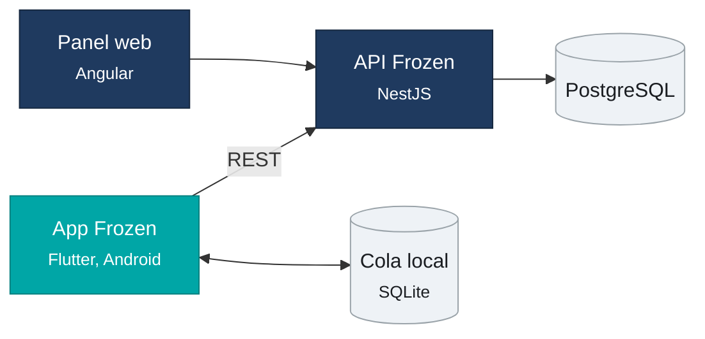
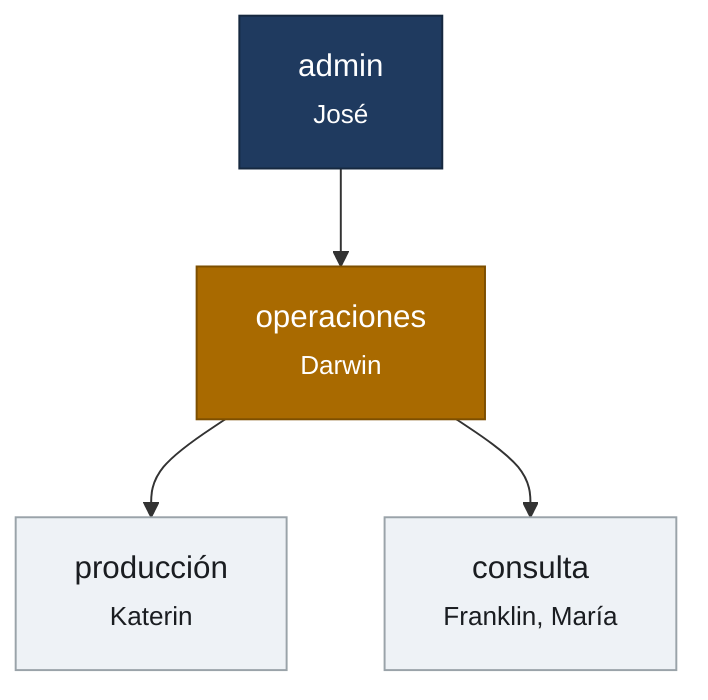
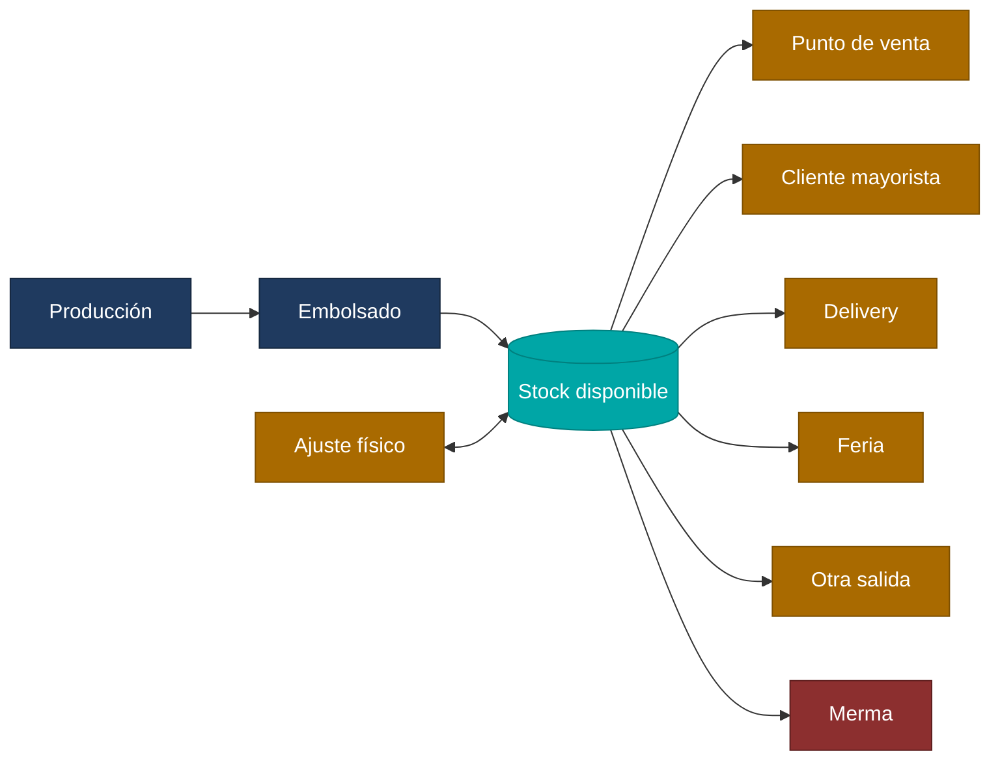
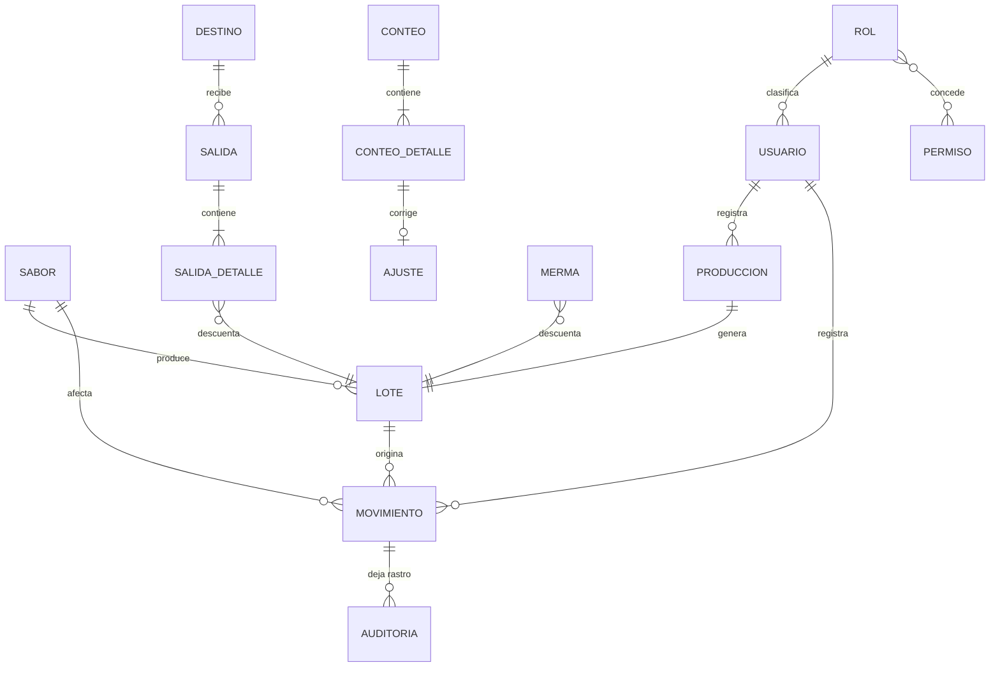
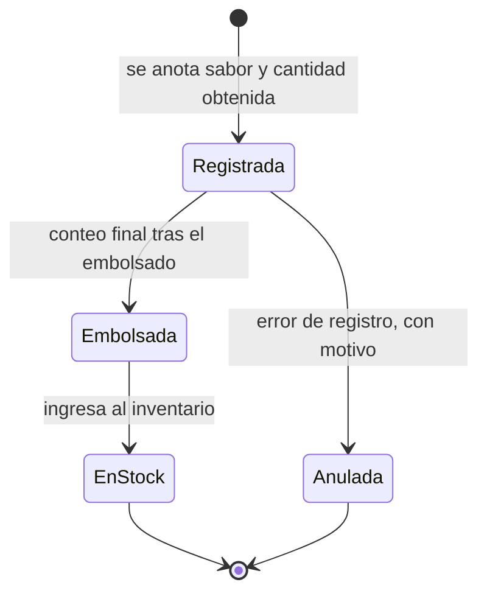
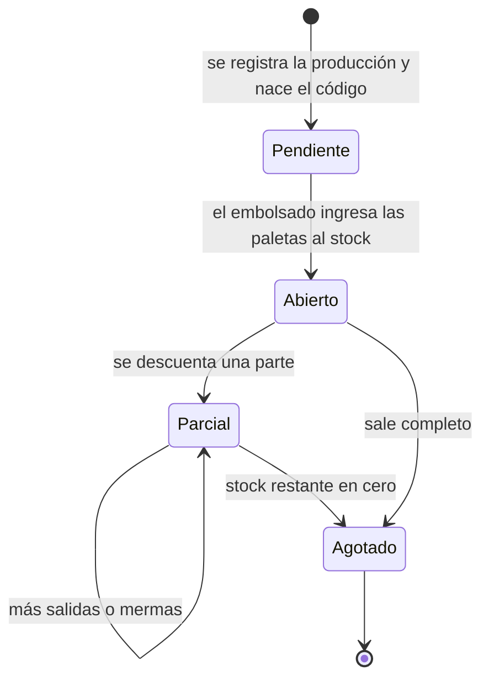
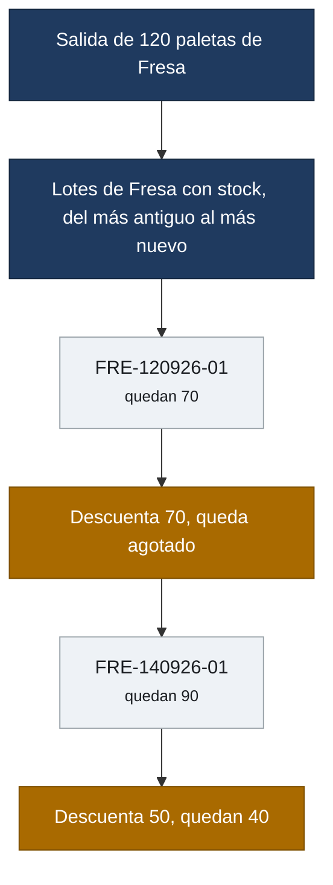
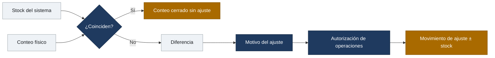
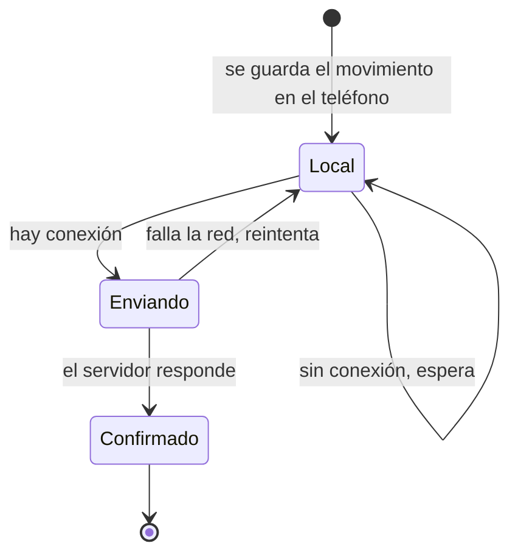
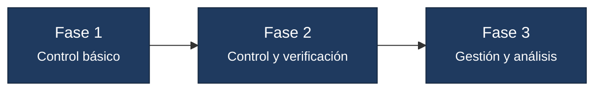

# Frozen Paletas Artesanales

## Descripción

Sistema de control operativo de paletas artesanales para Frozen, en Puerto Maldonado. Registra el recorrido del producto desde que sale de producción hasta que abandona el almacén: producción, embolsado, ingreso al stock, salidas por canal, mermas y verificación física.

El objetivo es que cualquiera de los usuarios operativos pueda responder desde el celular:

- ¿Cuántas paletas hay disponibles?
- ¿Cuántas hay por sabor?
- ¿Qué se produjo y cuándo?
- ¿Cuántas quedaron listas después del embolsado?
- ¿Qué producto salió y hacia dónde?
- ¿Qué mermas ocurrieron?
- ¿Qué sabores necesitan producirse?
- ¿El stock del sistema coincide con el conteo físico?

La unidad de control es la **paleta individual**. Los montos se manejan en soles (PEN).

## Stack

| Capa | Tecnología |
|---|---|
| Backend | NestJS |
| ORM | Prisma |
| Base de datos | PostgreSQL |
| Documentación de la API | Swagger en `/api/docs` |
| Panel web | Angular con Tailwind |
| App móvil | Flutter, Material 3 |
| Estado en la app | Riverpod |
| Peticiones | `dio` sobre cliente generado desde el OpenAPI |
| Base local de la app | `drift` sobre SQLite |
| Credenciales en el móvil | `flutter_secure_storage` |
| Compilación del APK | Docker, sin instalar Flutter en el servidor |
| Parches en caliente | Shorebird |
| Moneda | PEN |

El backend y el panel web siguen el mismo patrón que `gv-hub`; la app móvil, el de `movil-grupo-valderrama`. El cliente de la API **no se escribe a mano**: se genera desde la especificación que publica NestJS y se regenera cuando cambia un DTO.

## Arquitectura



Un solo backend y una sola base de datos. La APK es el cliente principal, el que se usa en el día a día. El panel web existe para lo que no se resuelve de pie: reportes con filtros de fechas, comparativas por periodo y mantenimiento del catálogo.

El backend es un **monolito modular**: un solo despliegue dividido en módulos por dominio, cada uno con su controlador, su servicio y sus DTO. Los módulos se hablan por los servicios que exportan, nunca por la base de datos del otro.

| Módulo | Responsabilidad |
|---|---|
| `auth` | Inicio de sesión, renovación del token y perfil |
| `permisos` | Catálogo de permisos y su reparto por rol, editable en caliente |
| `usuarios` | Alta, edición y baja de los usuarios operativos |
| `sabores` | Catálogo de sabores, su categoría, su estado y su stock mínimo |
| `inventario` | Núcleo del stock: libro de movimientos, descuento PEPS y consultas |
| `lotes` | Generación del código de lote y consulta de su trazabilidad |
| `produccion` | Registro en dos tiempos: producción y conteo del embolsado |
| `destinos` | Puntos de venta, clientes mayoristas, ferias y clientes de delivery |
| `salidas` | Salidas por canal con su detalle por lote |
| `mermas` | Pérdidas y el catálogo de causas |
| `panel` | Resumen del estado de Frozen en una sola consulta |

`inventario` es el único módulo que escribe en el libro de movimientos: producción, salidas y mermas le piden el movimiento en lugar de tocar el stock por su cuenta. Así la regla de PEPS y la prohibición de stock negativo viven en un solo sitio.

El criterio de reparto es el mismo que en Grupo Valderrama: entra a la app lo que se hace en dos toques —registrar una producción, descontar una salida, anotar una merma, contar el físico—; lo que exige leer una tabla ancha se queda en la web.

## Roles y permisos



| Rol | Usuario | Alcance |
|---|---|---|
| admin | José | Acceso técnico. Mantenimiento, catálogos, altas de usuarios y edición de permisos. |
| operaciones | Darwin | Acceso operativo completo. Consulta inventario, registra y revisa movimientos, autoriza ajustes y consulta reportes. |
| producción | Katerin | Registra producción, cantidad final embolsada y mermas. Realiza el conteo físico. Consulta inventario. |
| consulta | Franklin, María | Visualiza información general: inventario, movimientos e indicadores. A María se le habilitarán funciones operativas cuando se le asignen formalmente. |

### Matriz de permisos

| Acción | admin | operaciones | producción | consulta |
|---|---|---|---|---|
| Consultar inventario e indicadores | Sí | Sí | Sí | Sí |
| Registrar producción y embolsado | Sí | Sí | Sí | No |
| Registrar mermas | Sí | Sí | Sí | No |
| Registrar salidas | Sí | Sí | No | No |
| Realizar conteo físico | Sí | Sí | Sí | No |
| Autorizar ajustes de inventario | Sí | Sí | No | No |
| Administrar sabores | Sí | Sí | No | No |
| Administrar clientes y puntos de venta | Sí | Sí | No | No |
| Consultar reportes | Sí | Sí | No | Sí |
| Crear usuarios y editar permisos | Sí | No | No | No |

Los permisos viven en base de datos, no en el código: se conceden y se retiran desde el panel sin recompilar la APK ni redesplegar la API. Un permiso retirado oculta la pantalla en la app y cierra el endpoint en el backend.

## Lógica del inventario



Movimientos que afectan el stock:

| Movimiento | Efecto |
|---|---|
| Paletas terminadas y embolsadas | + Stock |
| Salida a PDV | − Stock |
| Venta a cliente mayorista | − Stock |
| Delivery | − Stock |
| Salida a feria | − Stock |
| Merma | − Stock |
| Ajuste de inventario físico | ± Stock con justificación |

El stock se incrementa cuando las paletas terminaron producción y embolsado y quedaron aptas para comercialización, nunca antes. Una producción en curso no suma inventario.

Ningún movimiento altera el stock por su cuenta: cada uno escribe una fila en el libro de movimientos y el stock del lote y del sabor se deriva de ahí. Así una corrección nunca borra el rastro.

## Modelo de datos



| Entidad | Contenido |
|---|---|
| `sabor` | Nombre, abreviatura, categoría, estado (activo o próximo) y stock mínimo propio |
| `produccion` | Fecha, sabor, cantidad obtenida, cantidad embolsada, merma, responsable y estado |
| `lote` | Código, sabor, fecha de producción, cantidad ingresada y stock restante |
| `movimiento` | Libro mayor del inventario: fecha, tipo, sabor, lote, cantidad con signo, usuario y referencia |
| `salida` y `salida_detalle` | Cabecera con fecha, tipo y destino; detalle con sabor, lote, cantidad y precio |
| `destino` | Puntos de venta, clientes mayoristas, ferias y clientes de delivery |
| `merma` | Fecha, sabor, lote, cantidad, causa, observación y responsable |
| `conteo` y `conteo_detalle` | Conteo físico quincenal con stock del sistema, stock contado y diferencia |
| `ajuste` | Corrección derivada de un conteo, con motivo y usuario que autoriza |
| `usuario`, `rol`, `permiso` | Credenciales y permisos concedidos, editables desde el panel |
| `auditoria` | Valor anterior, valor nuevo, usuario y motivo de cada corrección |

El stock por sabor no se guarda en un campo suelto: sale de sumar los movimientos del sabor. El `stock_restante` del lote es el que sostiene la trazabilidad y el que consume el descuento por PEPS.

---

# Módulo 1. Sabores

## Finalidad

Administrar el catálogo de sabores que maneja Frozen.

## Sabores actuales

### Con relleno

1. Maracuyá con relleno de leche condensada
2. Fresa con relleno de leche condensada
3. Coco con relleno de manjar
4. Cacao con relleno de fresa
5. Café con relleno de chocolate

### Amazónicos

6. Aguaje
7. Copoazú

### Frutales

8. Limón
9. Plátano

### Cremosos y clásicos

10. Queso helado
11. Yogurt
12. Oreo

### Inspirados en bebidas

13. Ron con pasas

## Sabores próximos

Cocona, lúcuma, dulce de leche y pisco sour.

## Funciones

- Crear sabor.
- Editar sabor.
- Activar o desactivar sabor.
- Clasificar sabores por categoría.
- Diferenciar entre **activo** y **próximo/inactivo**.

Solo los sabores activos generan alertas de stock. Un sabor próximo existe en el catálogo y se puede producir para prueba, pero no entra en la lista de reposición.

Un sabor con movimientos no se elimina, se desactiva: el histórico y los lotes antiguos siguen consultables.

---

# Módulo 2. Producción

## Finalidad

Registrar las paletas elaboradas y conocer el rendimiento real de cada producción.

Normalmente se producen alrededor de **3 baldes por día**, equivalentes a unas **450 paletas**, aunque la cantidad varía.

Responsable principal: **Katerin**.

## Datos mínimos

- Fecha.
- Sabor.
- Cantidad obtenida al terminar la producción.
- Cantidad final después del embolsado.
- Merma, si existe.
- Responsable.
- Lote.

## Flujo



La producción entra en dos tiempos. Primero se registra lo que salió del balde; después, al terminar el embolsado, se anota la cantidad apta. **El stock se mueve recién en el segundo paso.** Entre uno y otro la producción queda visible como pendiente de embolsar, para que no se olvide ninguna.

La merma de producción se calcula sola: cantidad obtenida menos cantidad embolsada. Si el registro deja diferencia, exige causa.

### Ejemplo

- Sabor: Coco
- Producción obtenida: 150 paletas
- Paletas embolsadas y aptas: 147
- Merma: 3
- **Ingreso al stock: 147 paletas**

El sistema conserva las dos cantidades, la producida y la final apta para venta. El rendimiento por sabor sale de esa relación.

---

# Módulo 3. Lotes y trazabilidad

## Finalidad

Identificar cuándo fue producido cada grupo de paletas y de dónde salió cada unidad que se vende.

Cada producción genera un lote. No hay paletas en stock sin lote.

## Código de lote

`FRE-140926-01`

| Segmento | Significado |
|---|---|
| `FRE` | Abreviatura del sabor, tres letras, definida en el catálogo |
| `140926` | Fecha de producción en formato DDMMAA |
| `01` | Correlativo de la producción del día para ese sabor |

Lo genera el backend dentro de la misma transacción que crea la producción, tomando el correlativo con bloqueo por sabor y fecha. Nunca lo escribe el usuario, y dos registros simultáneos no pueden obtener el mismo número.

## Información del lote

- Código.
- Sabor.
- Fecha de producción.
- Cantidad producida.
- Cantidad embolsada.
- Merma.
- Responsable.
- Stock restante del lote.

## Ciclo de vida



El código existe desde que se registra la producción, para poder rotular las bolsas, pero el lote no tiene stock hasta el conteo del embolsado.

Un lote agotado no desaparece: sigue consultable para reconstruir a dónde fue a parar cada paleta.

---

# Módulo 4. Inventario de producto terminado

## Finalidad

Mostrar en tiempo real cuántas paletas están disponibles para comercialización.

Unidad de control: **paletas individuales**.

## Funciones

- Stock total.
- Stock por sabor.
- Consulta por lote.
- Historial de movimientos.
- Stock mínimo.
- Alertas de reposición.
- Ajustes autorizados.

## Stock mínimo

Valor inicial: **80 paletas por sabor activo**.

| Situación | Estado |
|---|---|
| Más de 80 unidades | Stock disponible |
| 80 unidades o menos | Requiere reposición |
| 0 unidades | Agotado |

Las 80 unidades son la regla de arranque y viven como columna del sabor, no como constante del código: más adelante cada sabor podrá tener su propio mínimo según rotación y demanda real, sin tocar la aplicación.

---

# Módulo 5. Salidas de producto

## Finalidad

Registrar hacia dónde salen las paletas y descontarlas automáticamente del inventario.

## Tipos de salida

| Tipo | Descripción |
|---|---|
| Punto de venta | Abastecimiento a establecimientos incorporados como PDV de Frozen |
| Cliente mayorista | Persona o comercio que compra cantidad mayorista, por ejemplo 100 paletas, sin pertenecer a la red de PDV |
| Delivery | Venta directa al consumidor. Pedido mínimo de **12 unidades** a **S/ 5.00 por paleta**, con delivery gratuito dentro de Puerto Maldonado |
| Feria | Paletas retiradas del inventario para comercializar en ferias |
| Otra salida | Movimientos excepcionales. El motivo es obligatorio |

## Datos mínimos

- Fecha.
- Tipo de salida.
- Cliente, PDV o destino.
- Sabor.
- Cantidad.
- Lote, cuando corresponda.
- Usuario que registra.

## Descuento por lotes



La salida descuenta **primero los lotes más antiguos** (PEPS) y se reparte entre varios cuando hace falta. Quien registra puede forzar un lote concreto si el producto físico que despachó no fue el más antiguo; en ese caso el sistema guarda que el lote se eligió a mano.

Si la cantidad pedida supera el stock del sabor, la salida se rechaza entera. No se permite stock negativo.

## Formas de registro

1. Descontar el producto desde un pedido ya registrado.
2. Registrar una salida manual cuando sea necesario.

---

# Módulo 6. Mermas

## Finalidad

Registrar producto que se pierde y ya no queda disponible para la venta.

Responsable principal: **Katerin**.

## Causas

- Rotura.
- Defecto de presentación.
- Caída o contaminación.
- Descongelamiento.
- Error durante producción.
- Error durante embolsado.
- Otro motivo, con descripción obligatoria.

El vencimiento no se considera causa predeterminada por ahora. Las causas viven en base de datos y se amplían desde el panel.

## Datos mínimos

- Fecha.
- Sabor.
- Lote.
- Cantidad.
- Causa.
- Observación.
- Responsable del registro.

## Merma de producción y merma de stock

| Momento | Qué pasa con el inventario |
|---|---|
| Durante producción o embolsado | No descuenta: esas paletas nunca llegaron a ingresar. Queda registrada para el rendimiento |
| Producto ya ingresado al stock | Descuenta del lote y del sabor |

La distinción importa: si la merma de embolsado descontara stock, se restaría dos veces lo que ya se restó al ingresar solo las paletas aptas.

---

# Módulo 7. Inventario físico y ajustes

## Finalidad

Comprobar que el stock registrado coincide con las paletas que realmente existen.

Responsable: **Katerin**. Frecuencia: **cada 15 días**.

## Flujo



El sistema guarda fecha del conteo, stock registrado, stock físico, diferencia, motivo del ajuste, usuario que contó y usuario que autorizó la corrección.

El stock del sistema se congela al abrir el conteo, para que los movimientos registrados mientras se cuenta no ensucien la comparación.

No hace falta contar todo a diario. El inventario se actualiza con los movimientos y el conteo sirve de verificación periódica.

---

# Módulo 8. Alertas y reposición

## Finalidad

Ayudar a decidir qué sabores deben producirse.

## Regla inicial

Cuando un sabor activo tenga **80 paletas o menos**, aparece como producto que requiere reposición.

| Sabor | Stock | Estado |
|---|---|---|
| Coco | 54 | Reponer |
| Aguaje | 72 | Reponer |
| Oreo | 86 | Disponible |
| Fresa | 143 | Disponible |

## Vista de sabores a producir

Muestra automáticamente los sabores que alcanzaron o bajaron del stock mínimo, ordenados por lo lejos que están del umbral. Es la primera pantalla que se abre antes de producir.

Más adelante el sistema podrá sugerir cantidades usando ventas históricas y velocidad de rotación.

---

# Módulo 9. Panel principal

## Finalidad

Conocer el estado de Frozen sin revisar varios registros. Al entrar se ve como mínimo:

| Bloque | Contenido |
|---|---|
| Stock total | Suma de paletas disponibles |
| Stock por sabor | Lista con su estado de reposición |
| Sabores a reponer | Los que están en el mínimo o por debajo |
| Producciones recientes | Últimas producciones con su rendimiento |
| Salidas recientes | Qué salió, a dónde y quién lo registró |
| Mermas registradas | Últimas pérdidas con su causa |

## Indicadores posteriores

Cuando exista suficiente historia: producción por periodo, salidas por sabor, sabores de mayor y menor rotación, porcentaje de merma, diferencias de inventario y salidas por canal.

---

# Módulo 10. Usuarios y permisos

## Usuarios operativos

Franklin, Darwin, Katerin y María. José tiene acceso técnico para desarrollo, mantenimiento y administración.

Campos del usuario:

| Campo | Nota |
|---|---|
| nombres | |
| apellidos | |
| correo | Único, sirve de credencial de acceso |
| contraseña | Se almacena hasheada, nunca en claro |
| rol | Determina el conjunto de permisos concedidos |

El detalle de qué puede hacer cada rol está en [Roles y permisos](#roles-y-permisos). Los permisos se modifican desde el panel sin reprogramar la APK.

## Sesión

El acceso se hace con correo y contraseña. El token JWT se guarda en `flutter_secure_storage`, que en Android usa el almacén de claves del sistema, nunca en preferencias en claro. La sesión sobrevive al cierre de la app y, al expirar, manda al inicio de sesión sin perder lo que quedó pendiente de enviar.

---

# Módulo 11. Historial y auditoría

## Finalidad

Evitar que una modificación elimine la trazabilidad del inventario.

Cada movimiento guarda fecha y hora, usuario, tipo de movimiento, sabor, cantidad, valor anterior, valor nuevo y motivo cuando hay corrección.

Los registros importantes no se eliminan. Una corrección se hace con un movimiento de ajuste que compensa al anterior y deja las dos filas visibles: qué se registró primero, qué se corrigió y por qué. El histórico es de solo lectura incluso para el admin.

---

# Módulo 12. Reportes

## Reportes iniciales

- Stock actual por sabor.
- Producción por fecha.
- Producción por sabor.
- Salidas por periodo.
- Salidas por tipo de cliente o canal.
- Mermas por periodo.
- Mermas por causa.
- Historial de ajustes físicos.
- Sabores bajo stock mínimo.

Todos se filtran por rango de fechas y se exportan. Viven en el panel web: son tablas anchas que en el celular se leen mal.

---

## Trabajo sin señal

La producción y el embolsado se registran dentro del almacén, donde la cobertura falla. La app no puede quedarse esperando internet.



Reglas:

- Cada movimiento nace con su **clave de idempotencia en el teléfono**, no en el servidor. Si el envío se corta a mitad y se reintenta, el backend reconoce la clave y no duplica el registro.
- La cola local es de escritura. Las consultas de stock necesitan conexión: mostrar un inventario viejo como si fuera el actual es peor que no mostrarlo.
- Cada fila muestra su estado real: pendiente de enviar, enviando o confirmada. Quien registra siempre sabe qué llegó y qué no.
- Una salida encolada que al sincronizar dejaría el stock en negativo se rechaza y vuelve marcada como conflicto, con el stock real del momento, para corregirla a mano.

---

## Decisiones técnicas

Los puntos que el documento de requerimientos dejaba por definir, resueltos:

| Pregunta | Decisión |
|---|---|
| Generación del código de lote | `SAB-DDMMAA-NN`, correlativo por sabor y día, generado por el backend con bloqueo transaccional |
| Orden de descuento en las salidas | PEPS: primero el lote más antiguo con stock, repartiendo entre lotes si hace falta. Se puede forzar un lote concreto y queda registrado |
| Movimientos corregibles y quién autoriza | Ninguno se edita ni se borra: se corrige con un movimiento de ajuste. El rol de operaciones autoriza los ajustes de inventario |
| Funcionamiento sin conexión | Cola local en SQLite con clave de idempotencia. Solo para registrar; las consultas exigen conexión |
| Notificaciones de stock mínimo | Fase 3. En fase 1 la alerta vive en el panel y en la vista de sabores a producir |
| Relación con el sistema de gastos y pagos | Fuera del alcance inicial. Frozen tiene su propia base; la integración se evalúa cuando el control de inventario esté en uso |
| Respaldo y recuperación | Volcado diario de PostgreSQL con retención de 30 días, más el histórico de movimientos, que permite reconstruir el stock desde cero |

---

## Fases de desarrollo



| Fase | Módulos |
|---|---|
| Fase 1 — Control básico | Sabores, producción, lotes, inventario, salidas, mermas y panel básico |
| Fase 2 — Control y verificación | Inventario físico, alertas de reposición, usuarios y permisos, historial y auditoría |
| Fase 3 — Gestión y análisis | Reportes, indicadores, reposición basada en rotación e integración con los demás controles de Frozen |

No hace falta desarrollar todos los módulos completos desde el primer día.

---

## Estructura del repositorio

| Ruta | Contenido |
|---|---|
| `backend/` | API NestJS con Prisma y PostgreSQL, un módulo por dominio |
| `backend/prisma/` | Esquema, migraciones y datos iniciales |
| `backend/src/generated/prisma/` | Cliente de Prisma generado, no se commitea |
| `frontend/` | Panel web en Angular |
| `movil/` | App Flutter |
| `infra/` | Compilación del APK en Docker y despliegue |
| `test/` | Pruebas del sistema |

## Entorno

Node 22 vía nvm (`~/.nvm`) y pnpm. No se toca el node del sistema.

```bash
export NVM_DIR="$HOME/.nvm"; . "$NVM_DIR/nvm.sh"
cd backend && pnpm install
```

Base de datos `frozen` en PostgreSQL 16. Las credenciales viven en `backend/.env`, que no se commitea. El rol necesita `CREATEDB` para la shadow database de las migraciones de Prisma.

Flutter no se instala en el servidor: el APK se compila en Docker, igual que en `movil-grupo-valderrama`.

## Resultado esperado

El sistema no se limita a mostrar una cantidad de paletas. Registra el movimiento del producto desde que termina su producción hasta que sale de Frozen, para abrir la app y saber de inmediato:

> **qué hay disponible, qué se produjo, qué salió, qué se perdió, qué necesita reposición y si el inventario registrado coincide con la existencia física.**
